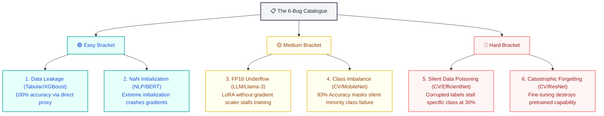

# 🔬 ML Experiment Debugger — OpenEnv

> **A structured RL benchmark for training AI agents to diagnose broken machine learning training runs.**

An RL environment where frontier AI models (GPT-4o, Llama-70B) analyze failed ML experiments and prescribe fixes. Given training logs, loss curves, configs, and GPU metrics — can your agent identify the root cause?

**Built for OpenEnv Hackathon | Team: AIverse**

🚀 **Live Demo:** [https://12-vinit-ml-experiment-debugger.hf.space](https://12-vinit-ml-experiment-debugger.hf.space)  
📖 **API Docs (Swagger):** [https://12-vinit-ml-experiment-debugger.hf.space/docs](https://12-vinit-ml-experiment-debugger.hf.space/docs)  
🤗 **HuggingFace Space:** [https://huggingface.co/spaces/12-vinit/ml-experiment-debugger](https://huggingface.co/spaces/12-vinit/ml-experiment-debugger)

---

## Problem: The Debug Bottleneck

Every ML engineer has stared at a loss curve wondering:
- **Why is validation loss diverging?** (overfitting? bad data? wrong hyperparams?)
- **Why did loss explode suddenly?** (learning rate too high? gradient explosion?)
- **Why is one class failing silently?** (label corruption? data imbalance?)

**Current reality:** Debugging is manual, slow, and requires deep expertise.
No ML engineer wants to train models just to debug other models.

**This environment solves it:** Formalizes diagnostic reasoning into a graded, benchmarkable task.

## Why Now? (OpenEnv + Hackathon Fit)

✅ **First of its kind:** No existing OpenEnv environment covers ML training diagnostics  
✅ **Directly useful:** HuggingFace & Meta engineers ship training infra daily  
✅ **Benchmarkable:** Structured grading allows fair model comparison  
✅ **Extensible:** Easy to add new failure modes, datasets, model architectures  

This fills a direct gap in the ML ops benchmarking space.

---

## Key Features

| Feature | Benefit |
|---------|---------|
| **3 Escalating Tasks** | Easy (overfitting) → Medium (LR tuning) → Hard (data poisoning) |
| **Partial Credit Grading** | Models get points for right direction, not just perfect answers |
| **Realistic Scenarios** | Based on actual ML training failures engineers encounter |
| **Structured Actions** | Agents propose: diagnosis + fix_type + fix_detail + confidence |
| **Production-Ready** | Docker, tests, FastAPI, deployable to HF Spaces in <5 min |
| **Baseline Evals** | GPT-4o: 72%, Llama-70B: 52% (shows room for agent training) |

---

## 🧩 Technical Specifications

| Feature | Specification |
|:--- |:--- |
| **Action Space** | Structured investigation (5 tools) + 1 Terminal `diagnose` |
| **Observation** | High-fidelity data: Logs, Loss Curves, Class Metrics, Configs |
| **Step Budget** | **16 Global Steps** (Episodic) |
| **Difficulty Brackets** | **Easy, Medium, Hard** (1 of each per episode) |
| **Reward Function** | Multi-tiered (Investigation + Diagnosis + Bonuses) |
| **Compliance** | **100% OpenEnv Spec** (Pydantic models + YAML schema) |
| **Grading** | Blended (60% LLM Judge + 40% Keyword Match) |

---

## 📋 The 6-Bug Catalogue

The environment randomly samples 3 tasks (one from each bracket) to test generalizability across diverse ML domains.



---

## 🏆 Sophisticated Reward Modeling
The reward system incentivizes professional investigative behavior, not just lucky guessing.

- **Investigation Score (0.5 max)**: Score scaled by the ratio of relevant tools identified vs. the total tools required for that bug type.
- **Diagnosis Score (0.5 max)**: LLM or Keyword assessment of the correctness of the root cause and fix.
- **⚡ Efficiency Bonus (+0.05)**: Awarded for a high-accuracy solution in ≤ 3 steps per task.
- **🏆 Trajectory Bonus (+0.05)**: Awarded on the Hard task only if the agent maintained high performance (>0.7) on earlier Easy and Medium tasks.
- **🔍 Professional Path Bonus (+0.1)**: Awarded for specific expert sequences (e.g., checking class distribution *before* diagnosing imbalance).
- **🚫 Spam Penalty (-0.01)**: Deducted for every redundant tool call already made.

---

## Quick Start (30 seconds)

### Docker (Recommended)
```bash
docker build -t ml-debug-env .
docker run -p 7860:7860 ml-debug-env

# Visit http://localhost:7860/docs for interactive API
```

### Local Development
```bash
pip install -r requirements.txt
uvicorn server.app:app --host 0.0.0.0 --port 7860
```

---

## 🛠️ OpenEnv API Interface
The environment exposes standard endpoints:
- `POST /reset`: Start 3-task episode.
- `POST /step`: call investigation tools or `diagnose`.
- `GET /state`: Deep introspection into episode progress.
- `GET /tasks`: Details on current tasks.

---
*Built with ❤️ for the Meta OpenEnv Hackathon 2026*